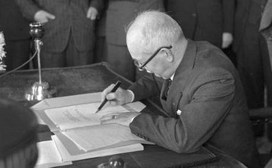

---
title: "Benešovy Dekrety"
date: 2018-04-29T11:24:07+02:00
draft: false
---

### BENEŠOVY DEKTERY A JEJICH VLIV NA ZÁMKY A HRADY NA JIŽNÍ MORAVĚ  
 
Benešovy dekrety začala v Londýně exilová vláda vydávat již 15.dubna roku 1940. Tyto dekrety měly prozatímně nahrazovat zákony v době, kdy nebylo možní vydávat zákony skrze Národní shromáždění. Prezident vydával dekrety s právní silou ústavních zákonů. Bylo publikováno 98 dekretů prezidenta a 7 dekretů bylo publikováno dodatečně. Všechny dekrety byly po válce roku 1946 uzákoněny. Dekrety se týkaly hlavně znárodnění většiny průmyslových podniků, pojišťoven, bank, zavedení centrálního plánování, všeobecné pracovní povinnosti, dále mezi ně patří dekrety spojené především s konfiskací majetku etnických Němců a Maďarů, zrádců a kolaborantů, ztrátou československého občanství pro Němce a Maďary, zrušené německé univerzity a německých vysokých škol technických. Změny nastolené dekrety zůstávají dodnes v platnosti. Z důvodu dekretů byl například zabaven a zkonfiskován zámek Milotice, zámek v Buchlovicích, zámek Rájec nad Svitavou a mnoho dalších.  

  
